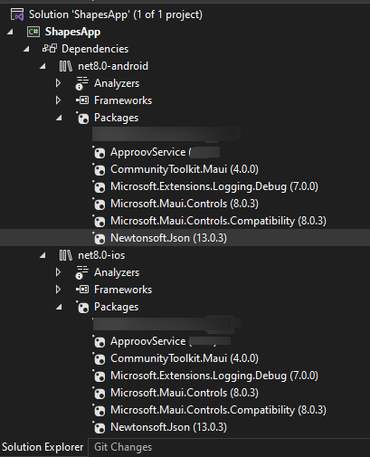
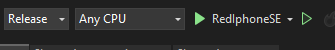
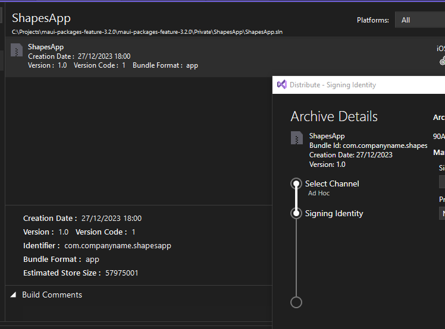

# SHAPES EXAMPLE

This quickstart is written specifically for native iOS and Android apps that are written in C# for making the API calls that you wish to protect with Approov. This quickstart provides a step-by-step example of integrating Approov into an app using a simple `Shapes` example that shows a geometric shape based on a request to an API backend that can be protected with Approov.

## WHAT YOU WILL NEED
* Access to a trial or paid Approov account
* The `approov` command line tool [installed](https://approov.io/docs/latest/approov-installation/) with access to your account
* [Visual Studio](https://visualstudio.microsoft.com/vs/mac/) with Xamarin extensions (Mac version 8.10.25 is used in this guide)
* The contents of the folder containing this README
* An Apple mobile device with iOS 10 or higher or an Android 5.0+ device. Alternatively, iOS simulator or Android emulator would suffice
* Nuget packages supporting the native Approov SDK: `ApproovService` version `3.1.4`, `ApproovHttpClient` version `3.1.0`  and `Square.OkHttp3` version `4.9.3` if targetting Android

## RUNNING THE SHAPES APP WITHOUT APPROOV

Open the `ShapesApp.sln` solution in the `ShapesApp` folder using `File->Open` in Visual Studio. There are three projects in the solution, a shared `ShapesApp` project, one targeting iOS, `ShapesApp.iOS` and another targeting Android OS, `ShapesApp.Android`. We will use the iOS version in this document however there are minor differences with the Android application, i.e. codesigning and generating `.ipa` or `.apk` files. Regardless of which OS you choose to target, the source code is shared and is available in the common file `MainPage.xaml.cs`. You can target your prefered platform by selecting the Build target of Visual Studio.

If running the iOS application, select the `Info.plist` file and change the Bundle Identifier to contain a unique string (i.e. your company name), since Apple will reject the default one. Select the appropriate device/simulator target and run the ShapesApp application.

Once the application is running you will see two buttons:

<p>
    
</p>

Click on the `Hello` button and you should see this:

<p>
    
</p>

This checks the connectivity by connecting to the endpoint `https://shapes.approov.io/v1/hello`. Now press the `Shape` button and you will see this:

<p>
    
</p>

This contacts `https://shapes.approov.io/v1/shapes` to get the name of a random shape. It gets the http status code 200  because this endpoint is protected with a secret key which we hard coded in the source code, and therefore can be easily extracted from the app. Next, you will add Approov into the app so that it can generate valid Approov tokens and get shapes using an approov token.

## ADD THE APPROOV SDK

The Approov SDK is available as a NuGet package in the default `nuget.org` repository and is conveniently named `ApproovService`. Select `Project` and `Manage NuGet Packages...` then select `Browse` and search for the `ApproovService` package. Additionally, you need to remove any reference to `System.Net.Http` package from the `using` directive, since a custom subclass, `ApproovHttpClient` implements its functionality and is part of the `ApproovHttpClient` package. The Android native bindings provided by the `ApproovService` make use of the `OkHttp` network implementation and so the `Square.OkHttp3-4.9.3` needs also to be installed.

Your project structure should now look like this:



## ENSURE THE SHAPES API IS PROTECTED

In order for Approov tokens to be generated for `https://shapes.approov.io/v3/shapes` it is necessary to inform Approov about it: 

```
approov api -add shapes.approov.io
```

Tokens for this domain will be automatically signed with the specific secret for this domain, rather than the normal one for your account. 

## MODIFY THE APP TO USE APPROOV

To use Approov all you have to do is comment out the code using `HttpClient` and uncomment the line following that code, which enables the custom `ApproovHttpClient` code. Find the following lines in `MainPage.xaml.cs` source file:

```C#
/* COMMENT this line if using Approov */
private static HttpClient httpClient;
/* UNCOMMENT this line if using Approov */
//private static ApproovHttpClient httpClient;
public GetShapePlatform()
{
    /* Comment out the line to use Approov SDK */
    httpClient = new HttpClient();
    /* Uncomment the lines bellow to use Approov SDK */
    //ApproovService.Initialize("<enter-your-config-string-here>");
    //httpClient = ApproovService.CreateHttpClient();
```
Change the commented out lines so the code becomes:
```C#
/* COMMENT this line if using Approov */
//private static HttpClient httpClient;
/* UNCOMMENT this line if using Approov */
private static ApproovHttpClient httpClient;
public GetShapePlatform()
{
    /* Comment out the line to use Approov SDK */
    //httpClient = new HttpClient();
    /* Uncomment the lines bellow to use Approov SDK */
    ApproovService.Initialize("<enter-your-config-string-here>");
    httpClient = ApproovService.CreateHttpClient();
```

The Approov SDK needs a configuration string to identify the account associated with the app. It will have been provided in the Approov onboarding email (it will be something like `#123456#K/XPlLtfcwnWkzv99Wj5VmAxo4CrU267J1KlQyoz8Qo=`). Copy this string replacing the text `<enter-your-config-string-here>`.

You will also need to uncomment the `using Approov;` directive to the top of the `MainPage.xaml.cs` source file.
The `ApproovHttpClient` class adds the `Approov-Token` header and also applies pinning for the connections to ensure that no Man-in-the-Middle can eavesdrop on any communication being made. 

Finally, please, change the url to point to the Approov protected endpoint:

```C#
static string endpointVersion = "v1";
```
to point to `v3`:

```C#
static string endpointVersion = "v3";
```

### ADD YOUR SIGNING CERTIFICATE TO APPROOV
You should add the signing certificate used to sign apps so that Approov can recognize your app as being official.

Codesigning must also be enabled, if you need assistance please check [Microsoft's codesigning support](https://docs.microsoft.com/en-us/xamarin/ios/deploy-test/provisioning/) or [Android deploy signing](https://docs.microsoft.com/en-us/xamarin/android/deploy-test/signing/?tabs=macos). Make sure you have selected the correct project (Shapes.App.iOS), build mode (Release) and target device (Generic Device) settings.

### Android
Add the local certificate used to sign apps in Android Studio. The following assumes it is in PKCS12 format:

```
approov appsigncert -add ~/.android/debug.keystore -storePassword android -autoReg
```

Note, on Windows you need to substitute \ for / in the above command and the full path specified for the user home directory instead of ~.

See [Android App Signing Certificates](https://approov.io/docs/latest/approov-usage-documentation/#android-app-signing-certificates) if your keystore format is not recognized or if you have any issues adding the certificate. This also provides information about adding certificates for when releasing to the Play Store. Note also that you need to apply specific [Android Obfuscation](https://approov.io/docs/latest/approov-usage-documentation/#android-obfuscation) rules when creating an app release.

### iOS
These are available in your Apple development account portal. Go to the initial screen showing program resources:


Click on `Certificates` and you will be presented with the full list of development and distribution certificates for the account. Click on the certificate being used to sign applications from your particular Xcode installation and you will be presented with the following dialog:


Now click on the `Download` button and a file with a `.cer` extension is downloaded, e.g. `development.cer`. Add it to Approov with:

```
approov appsigncert -add development.cer -autoReg
```

If it is not possible to download the correct certificate from the portal then it is also possible to [add app signing certificates from the app](https://approov.io/docs/latest/approov-usage-documentation/#adding-apple-app-signing-certificates-from-app).

> **IMPORTANT:** Apps built to run on the iOS simulator are not code signed and thus auto-registration does not work for them. In this case you can consider [forcing a device ID to pass](https://approov.io/docs/latest/approov-usage-documentation/#forcing-a-device-id-to-pass) to get a valid attestation.

## RUNNING THE SHAPES APP WITH APPROOV

Make sure you have selected the correct project (Shapes.App.iOS), build mode (Release) and target device (Generic Device) settings. 



Select the `Build` menu and then `Archive for Publishing`. Once the archive file is ready you can either `Ad Hoc`, `Enterprise` or `Play Store` depending on the platform, sign it and save it to disk.



Install the `ApproovShapes.ipa` or `.apk` file that you just registered on the device. You will need to remove the old app from the device first.
If using Mac OS Catalina and targeting iOS, simply drag the `ipa` file to the device. Alternatively, using `Xcode` you can select `Window`, then `Devices and Simulators` and after selecting your device click on the small `+` sign to locate the `ipa` archive you would like to install. For Android you will need to use the command line tools provided by Google.


Launch the app and press the `Shape` button. You should now see this (or another shape):

<p>
    
</p>

This means that the app is getting a validly signed Approov token to present to the shapes endpoint.

## WHAT IF I DON'T GET SHAPES

If you still don't get a valid shape then there are some things you can try. Remember this may be because the device you are using has some characteristics that cause rejection for the currently set [Security Policy](https://approov.io/docs/latest/approov-usage-documentation/#security-policies) on your account:

* Ensure that the version of the app you are running is signed with the correct certificate.
* Look at the [`syslog`](https://developer.apple.com/documentation/os/logging) output from the device. Information about any Approov token fetched or an error is printed, e.g. `Approov: Approov token for host: https://approov.io : {"anno":["debug","allow-debug"],"did":"/Ja+kMUIrmd0wc+qECR0rQ==","exp":1589484841,"ip":"2a01:4b00:f42d:2200:e16f:f767:bc0a:a73c","sip":"YM8iTv"}`. You can easily [check](https://approov.io/docs/latest/approov-usage-documentation/#loggable-tokens) the validity.
* Use `approov metrics` to see [Live Metrics](https://approov.io/docs/latest/approov-usage-documentation/#metrics-graphs) of the cause of failure.
* You can use a debugger or emulator/simulator and get valid Approov tokens on a specific device by ensuring you are [forcing a device ID to pass](https://approov.io/docs/latest/approov-usage-documentation/#forcing-a-device-id-to-pass). As a shortcut, you can use the `latest` as discussed so that the `device ID` doesn't need to be extracted from the logs or an Approov token.
* Also, you can use a debugger or Android emulator and get valid Approov tokens on any device if you [mark the signing certificate as being for development](https://approov.io/docs/latest/approov-usage-documentation/#development-app-signing-certificates).
## SHAPES APP WITH SECRETS PROTECTION

This section provides an illustration of an alternative option for Approov protection if you are not able to modify the backend to add an Approov Token check. 

Firstly, revert any previous change to `shapesURL` to using `https://shapes.approov.io/v1/shapes/` that simply checks for an API key. The `shapes_api_key` should also be changed to `shapes_api_key_placeholder`, removing the actual API key out of the code:

```C#
/* The Shapes URL */
static string endpointVersion = "v1";
string shapes_api_key = "shapes_api_key_placeholder";
....
ApproovService.AddSubstitutionHeader("Api-Key", null);
ApproovService.DefaultRequestHeaders.Add("Api-Key", shapes_api_key);
```

You must inform Approov that it should map `shapes_api_key_placeholder` to `yXClypapWNHIifHUWmBIyPFAm` (the actual API key) in requests as follows:

```
approov secstrings -addKey shapes_api_key_placeholder -predefinedValue yXClypapWNHIifHUWmBIyPFAm
```

> Note that this command also requires an [admin role](https://approov.io/docs/latest/approov-usage-documentation/#account-access-roles).

Build and run and press the `Get Shape` button. You should now see this (or another shape):

<p>
    
</p>

This means that the app is able to access the API key, even though it is no longer embedded in the app configuration, and provide it to the shapes request.
